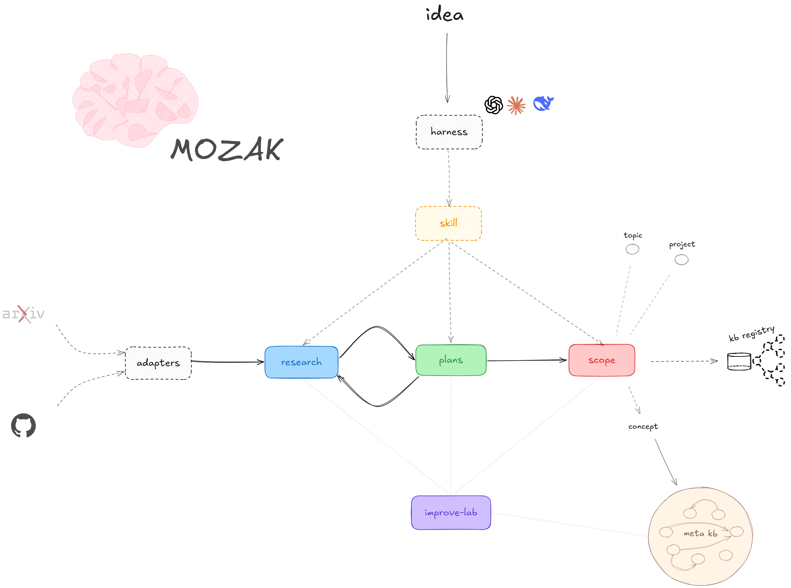

<p align="center">
  
</p>

<h1 align="center">MOZAK</h1>

<p align="center"><strong>Projects that keep improving.</strong></p>

<p align="center">
  MOZAK gives a research topic or code repository a Git-native memory:<br>
  what you learned, what you decided, what is ready, and what happened.
</p>

<p align="center">
  <a href="LICENSE"></a>
</p>

## Install

```bash
curl -fsSL https://raw.githubusercontent.com/pitfa19/mozak/main/scripts/install.sh | bash
mozak setup check "$HOME"
```

This installs `mozak`, `mozak-mcp`, and the MOZAK skill for Claude Code,
Jcode, Codex, and agents using the shared `.agents` convention. The installer
prints the exact configuration step when this is a new machine.

Prefer natural language? Tell your coding agent:

> Install MOZAK from `github.com/pitfa19/mozak`, then onboard this repository.

Joining projects that a teammate already onboarded? Use the
[teammate quickstart](docs/TEAMMATE-QUICKSTART.md). It covers the local KB and
project registration step that a binary install cannot safely guess.

## Why MOZAK

Long projects lose context. Agents repeat research, forget decisions, rebuild
plans, and start work that another session already handled.

MOZAK keeps the durable parts in Git:

- **Improve:** turn new papers, tools, and completed work into reviewable improvement plans.
- **Remember:** keep goals, evidence, decisions, progress, and rejected options across sessions.
- **Share:** give every person and agent working from the repository the same project state.
- **Reuse:** move a useful concept between repositories only after its assumptions are checked again.

MOZAK proposes. You approve. Pair it with an ambient agent to run the
improvement cycle periodically.

## Start

```bash
mozak project init .
mozak project overview .
```

Then tell your agent what you want:

> Use MOZAK to plan the next improvement and show me what is ready.

MOZAK also manages research topics without code. See the
[5-minute quickstart](docs/QUICKSTART.md).

## One example

A reusable publishing concept moved between two repositories. MOZAK checked
five assumptions in the target: one held, two needed replacements, and two were
rejected. The idea transferred without pretending both projects were identical.

MOZAK has also recorded its own development and produced six improvement
proposals. This is a real self-study, not a controlled comparison. See the
[case and concept model](docs/ARCHITECTURE.md).

## Six modules

`scope` holds topics and projects · `research` records evidence · `plans` tracks
goals and progress · `meta-kb` connects repositories · `improve-lab` proposes
upgrades · `skill` lets agents operate MOZAK for you.

## Why Rust

Rust makes MOZAK a fast, portable, offline binary with no language runtime. Its
type and memory safety help protect deterministic project state. Rust is how it
ships reliably, not the reason to use it.

## Read next

[Teammate quickstart](docs/TEAMMATE-QUICKSTART.md) · [New-project quickstart](docs/QUICKSTART.md) · [How it works](docs/ARCHITECTURE.md) ·
[Commands](docs/REFERENCE.md) · [Install and update](docs/distribution/INSTALL.md)

MIT licensed. Influences and prior work are listed in
[ACKNOWLEDGMENTS.md](ACKNOWLEDGMENTS.md).
