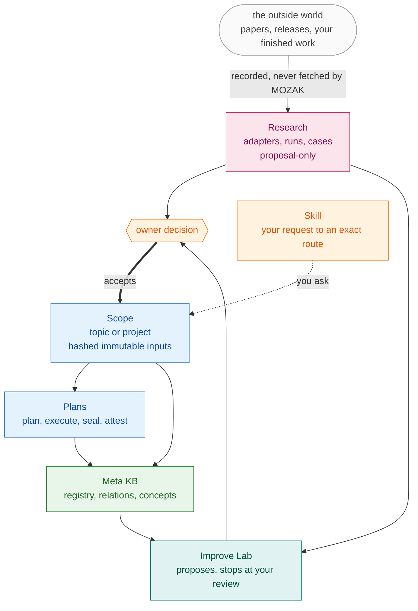

# MOZAK architecture

MOZAK is a local, offline, single-binary knowledge and project framework. It
holds the durable state around agent work: what a project is, what evidence
exists, what was decided, and what was actually observed.

Its architecture follows one rule:

> **MOZAK validates and records. It never infers authority, and it never
> mutates accepted state without an explicit owner decision.**

Everything below is a consequence of that rule.

For the same material as explorable diagrams, open
[`diagrams/`](diagrams/): the modules and what each may mutate, the Improve Lab
as an ordered run with its refusals, and how the KB registry pins Scopes while
the Meta KB relates projects.

## The one-paragraph model

Work happens inside a **Scope**. A Scope is either a **Topic** (a subject you
are learning about) or a **Project** (a repository you are changing). One
**Scope root**, a directory with one `scope.json`, can hold many Scope entries,
so a family of related projects and topics shares one manifest, one evidence
store, and one history. Evidence
enters a Scope only as pinned, hashed, immutable **inputs**. A Project also
carries a contract, a plan, and executions. Reusable insight is captured as a
**Concept**, and a Concept can only cross into another Scope through a
**Translation** that re-derives its assumptions. Finished work can be sealed
into an immutable **knowledge package**, and packages compose into a **Meta
KB**. Everything the outside world touches, such as research providers, arrives
through an **adapter**, whose output is proposal-only until you accept it.

## Layer diagram

```
┌─────────────────────────────────────────────────────────────────┐
│  OWNER                                                          │
│  the only source of acceptance, promotion, and authority        │
└───────────────────────────┬─────────────────────────────────────┘
                            │ explicit approvals
┌───────────────────────────▼─────────────────────────────────────┐
│  INTERFACE                mozak-cli                             │
│  deterministic JSON commands, no hidden state                   │
├─────────────────────────────────────────────────────────────────┤
│  WORKFLOWS                                                      │
│  project · scope · kb · meta · package · concept · case         │
│  adapter · lab · distribution                                   │
├─────────────────────────────────────────────────────────────────┤
│  CONTRACTS                mozak-core                            │
│  scope · kb · research · planning · execution · concept         │
│  case_study · knowledge_package · meta_kb · lab                 │
│  every rule is a validator that fails closed                    │
├─────────────────────────────────────────────────────────────────┤
│  FOUNDATION                                                     │
│  canonical JSON · SHA-256 identity · deterministic replay       │
└───────────────────────────┬─────────────────────────────────────┘
                            │ read / validated write
┌───────────────────────────▼─────────────────────────────────────┐
│  LOCAL STORAGE            KB root · Scope roots · repositories  │
│  content-addressed objects, plain files, no database, no server │
└─────────────────────────────────────────────────────────────────┘

        ▲ proposal-only, never trusted, never auto-accepted
┌───────┴─────────────────────────────────────────────────────────┐
│  DELIVERY (optional, outside the offline core)                   │
│  GitHub launcher · stable/main channels · update · rollback      │
├─────────────────────────────────────────────────────────────────┤
│  ADAPTERS (optional, outside MOZAK)                              │
│  DAIR.AI · arXiv · MCP registry · GitHub tooling                │
│  they do research networking; MOZAK validates recorded snapshots│
└─────────────────────────────────────────────────────────────────┘
```

The MOZAK core performs no networking. Optional adapters own research network
access. The installed delivery launcher separately owns authenticated GitHub
release checks and can modify only MOZAK installation state. Neither boundary
can accept knowledge or mutate Project, Scope, or KB state.

## Modules

MOZAK is six modules: **Scope**, **Research**, **Plans**, **Meta KB**,
**Improve Lab** and **Skill**. `mozak lab modules` prints them with the source
files each governs, and a test asserts every contract file belongs to exactly
one. [MODULES.md](MODULES.md) explains each one and where its design came from.

| Module | `mozak-core` files | Key guarantee |
|---|---|---|
| **Scope** | `scope` `project_contract` `project_context` | Inputs are immutable and content-addressed; a project states its own identity |
| **Research** | `research` `adapter_workflow` `landmark` `case_study` | Untrusted external data can never authorize an action; a summary stays addressable or fails closed |
| **Plans** | `planning` `execution` `project_release` `knowledge_package` `attestation` | A plan derives only from accepted inputs; claims must match the observed revision; every byte is pinned |
| **Meta KB** | `kb` `meta_kb` `concept` `meta_transfer` `package_import` | A registry records but never confers trust; reuse requires re-deriving every assumption |
| **Improve Lab** | `lab` | Planning-only; stops at owner review |
| **Skill** | `distribution` | Managed files are hash-pinned; drift is refused, not overwritten |

Ids, as the binary prints them: `scope`, `research`, `plans`, `meta-kb`,
`improve-lab`, `skill`.

`lib` holds canonical JSON, SHA-256 hashing and event replay. It is shared
foundation and belongs to no module. Verify the mapping with
`mozak lab modules`; `scripts/check_docs_match_binary.py` fails CI when this
page drifts from it.

No module may mutate accepted state without an approval that pins exact hashes.

### Command surface (`mozak-cli`)

| File | Commands |
|---|---|
| `project_workflow` | `project init/status/validate/overview/graph` |
| `project_registry` | `project discover/review/register/refresh/context` |
| `scope_workflow` | `scope init/add-topic/add-project/add-goal/validate/list/graph/export/ingest-links` |
| `kb_workflow` | `kb validate/list/tree/graph/register/repin/parity/import-package` |
| `meta_transfer_workflow` | `kb concept candidates/translation-packet` |
| `meta_workflow` | `meta validate/list/graph` |
| `package_workflow` | `package validate/list/attest/history` |
| `concept_workflow` | `concept validate/list/translation` |
| `case_workflow` | `case validate/list/reproduce-packet` |
| `adapter_workflow` | `adapter catalog/setup/list/show/run/recheck` |
| `lab_workflow` | `lab modules/start/refresh/select/read/mechanisms/plans/review/status` |
| `lifecycle` | `research`, `planning`, `execution` |
| `distribution` | `setup`, `doctor`; launcher: `delivery status`, `update`, `rollback` |

## How they relate

The README shows the drawn architecture. This is the same six as a precise
flow: evidence enters at the top and reaches your work only through a decision
you make. Rendered by GitHub from
[`diagrams/mozak-module-map.mmd`](diagrams/mozak-module-map.mmd), which is the
single copy of this diagram.



`scope`→`plans` and `plans`→`meta-kb` are real crate dependencies, checkable
with `grep 'use crate::' crates/mozak-core/src/*.rs`. The rest is workflow
order, not compile-time coupling.

To regenerate an image from the same source with
[mmdr](https://github.com/1jehuang/mermaid-rs-renderer):

```bash
cargo install mermaid-rs-renderer
mmdr -i docs/diagrams/mozak-module-map.mmd -o docs/diagrams/mozak-module-map.svg -e svg
```

## Why some things live where they do

Three placements are worth stating, because a reader could reasonably expect
otherwise:

- **Concepts sit under Meta KB**, not under Scope, because translation is a cross-project act. A Concept only earns its keep once a second target re-derives its assumptions.
- **Cases sit under Research**, not under Plans, because a case is an observation, held to the same evidence discipline as a paper.
- **Packages sit under Plans**, not under Meta KB, because a package is what finished work is sealed into, and the Meta KB merely composes it afterwards.
- **Adapters are not a module.** They are the network boundary Research owns. A boundary and a module are different things, and splitting them would reopen the question of which module a research run belongs to.

Cross-project reuse begins with `kb concept candidates`, which reads only the
configured, hash-pinned registry and returns a deterministic inventory rather
than a relevance ranking. Explicitly supplied research runs remain
proposal-only. After a person or agent selects an exact Concept hash, `kb
concept translation-packet` enumerates the source assumptions and the evidence
the target must produce. The packet is read-only preparation, not a Translation
and not adoption. The target still owns, authors, and validates the resulting
Translation.

## A module is an improvement surface

`mozak lab start` opens a run against exactly one of the six, so an improvement
question cannot silently span unrelated contracts. That is the mechanism that
keeps MOZAK current:

1. An adapter records new literature or a tool release. Output is proposal-only.
2. `mozak lab start` opens a run against one module with a scoped question.
3. The ordered steps refresh, select, read, mechanisms, plans, review each record an immutable transition. A mechanism must cite a real source claim, and each plan card carries at least two acceptance checks.
4. The run stops at `owner_reviewed`. Implementation is a separate decision.
5. Accepted work lands as a new plan version, and the module's section here changes with it.

That loop has run against MOZAK itself: `plan-mozak-self-host` records *Run the
Self Improvement Lab through its real contract end to end*, *Implement the four
plans the Lab's first contract run proposed*, and *Read the watched tooling for
standards a MOZAK module should adopt* as completed goals.

## The core objects

```
                    ┌──────────────┐
                    │   Meta KB    │  composition of packages
                    └──────┬───────┘
                           │ composes (never merges truth)
                    ┌──────▼───────┐
                    │   Package    │  immutable, offline-verifiable
                    └──────┬───────┘
                           │ sealed from
        ┌──────────────────▼──────────────────┐
        │              SCOPE                  │
        │   kind = topic  |  kind = project   │
        └──────┬───────────────────┬──────────┘
               │                   │
      ┌────────▼────────┐  ┌───────▼─────────┐
      │  Topic          │  │  Project        │
      │  inputs         │  │  contract       │
      │  meta goals     │  │  plan (goal DAG)│
      │  concepts       │  │  executions     │
      └────────┬────────┘  └───────┬─────────┘
               │  promotion pins the exact Topic snapshot
               └───────────────────┘

   Concept ──Translation──> another Scope
   (advisory only; assumptions must be re-derived in the target)
```

## Data flow: how evidence becomes knowledge

```
 external source
       │  adapter fetches (outside MOZAK, networked)
       ▼
 recorded snapshot ──► research run ──► MOZAK validates the contract
       │                                        │
       │                              proposal-only evidence
       │                                        │
       │                              OWNER ACCEPTS  ◄── the gate
       │                                        │
       ▼                                        ▼
 Scope input (hashed, immutable)        accepted planning input
                                                │
                                                ▼
                                          goal DAG plan
                                                │
                                                ▼
                                     execution + observed result
                                                │
                                                ▼
                                       project release
                                                │
                                                ▼
                                     immutable knowledge package
                                                │
                                                ▼
                                             Meta KB
```

Every arrow crossing into accepted state requires an explicit owner decision.
No arrow is automatic.

## Trust boundaries

There are exactly four, and each one fails closed.

1. **Network boundary.** MOZAK never fetches. Adapters fetch; MOZAK validates
   what they recorded. External content enters as `recorded`, immutable, and
   `untrusted_data`, and it can never authorize an action.
2. **Acceptance boundary.** Discovery, research, cases, and Lab runs all produce
   proposals. Only an owner approval pinned to exact hashes converts a proposal
   into accepted state.
3. **Drift boundary.** Bindings, packages, skills, and Scopes pin SHA-256
   hashes. A changed byte makes the thing unusable rather than silently
   different.
4. **Authority boundary.** Concepts, Meta Goals, cases, and Meta KBs are
   advisory. Composition, adoption, and registration never transfer truth,
   mutation rights, or execution authority.

## What MOZAK deliberately does not do

- No network access from the binary.
- No server, daemon, or database.
- No automatic discovery of your files.
- No inference of latest, official, canonical, trusted, or preferred.
- No overwriting of drifted state; it refuses instead.
- No self-modification. The Self Improvement Lab only proposes.

## Repository layout

```
crates/mozak-core/    contracts, validators, deterministic replay
crates/mozak-cli/     command surface, single `mozak` binary
skills/mozak/         portable agent skill, embedded into the binary
spec/                 executable specifications and schemas
scripts/adapters/     optional external adapters (networked, outside MOZAK)
docs/                 architecture, quickstart, distribution guides
```
