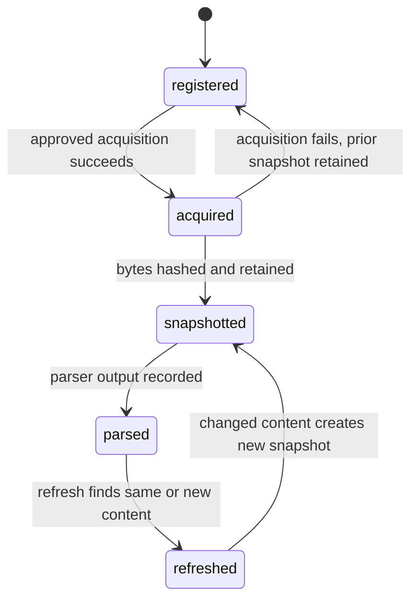
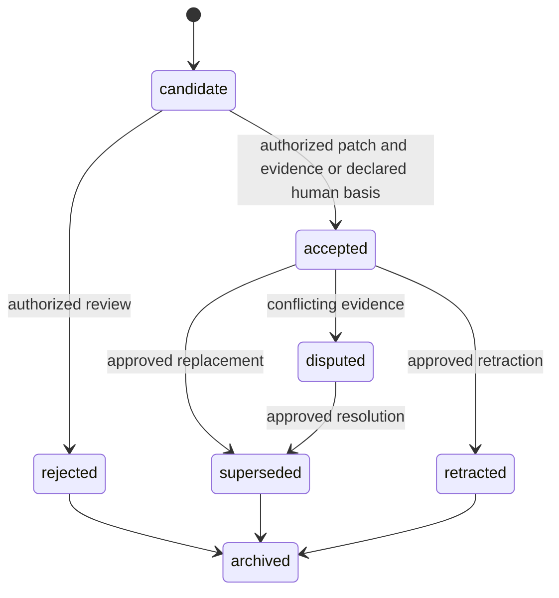
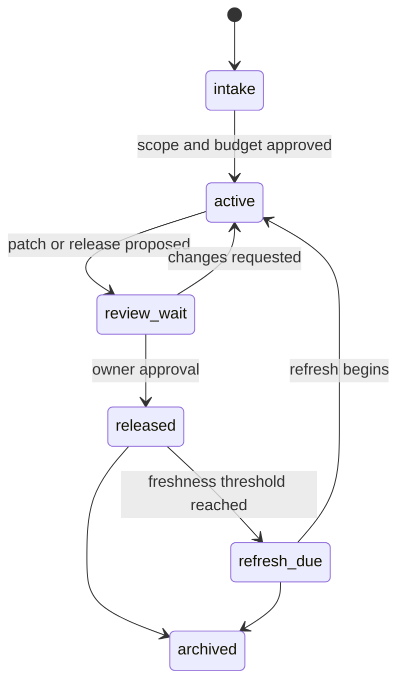
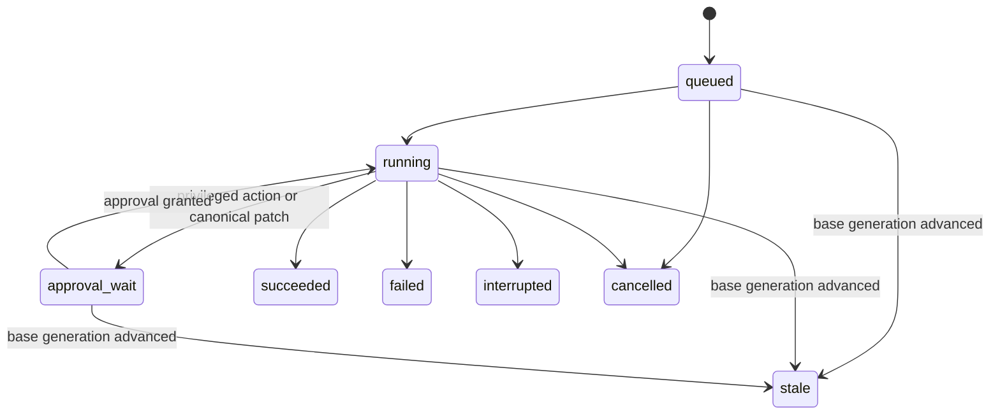
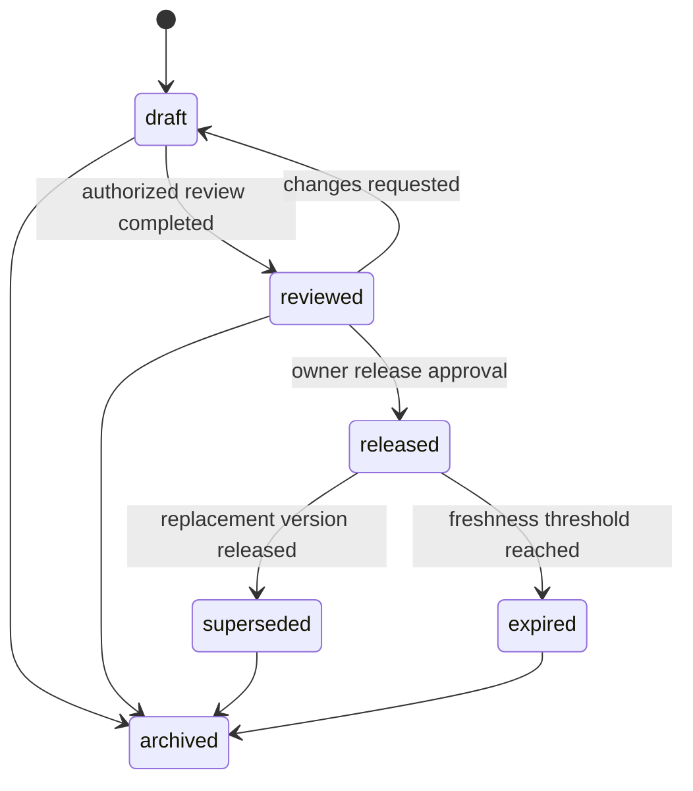

# Lifecycle diagrams

These diagrams are explanatory views of the normative transitions in `state-model.md`. Guards remain normative even when a diagram omits incidental metadata.

## Source

## Claim

## Discovery branch

## Job

## Packet

## Cross-cutting guards

- A transition that changes canonical claim state is represented by an authorized event in an approved, non-stale patch.
- Released packet bytes are immutable. Revision creates a new version and may set `supersedes`.
- Failure, cancellation, interruption, and staleness do not erase events, attempts, snapshots, or review records.
